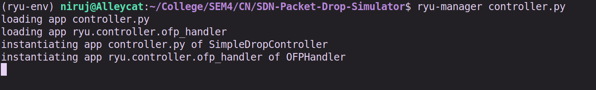
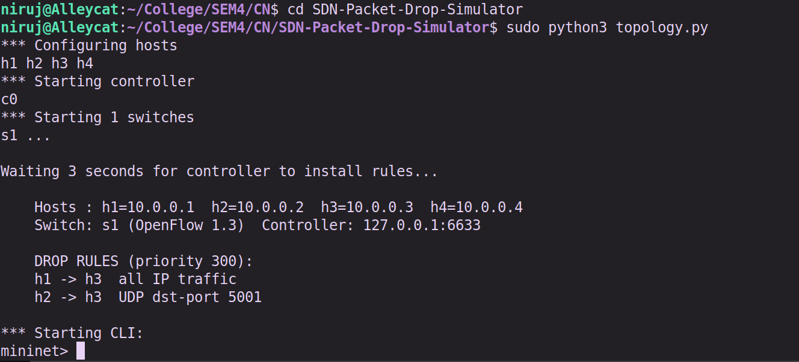
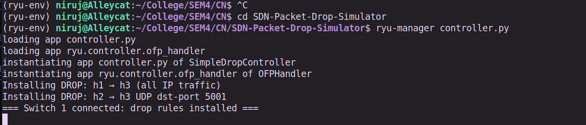
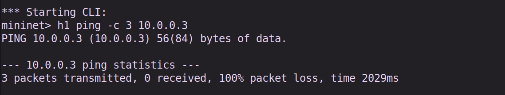
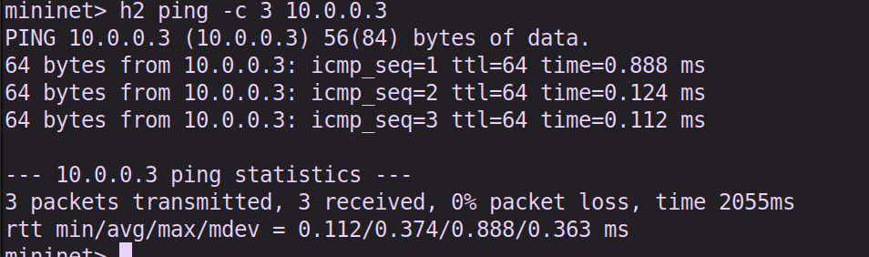
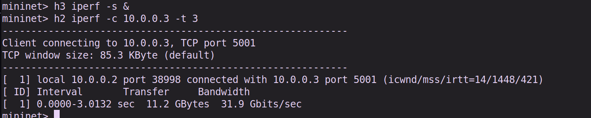
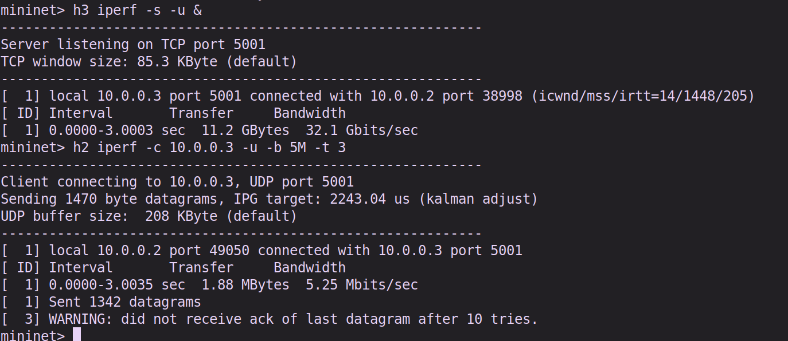
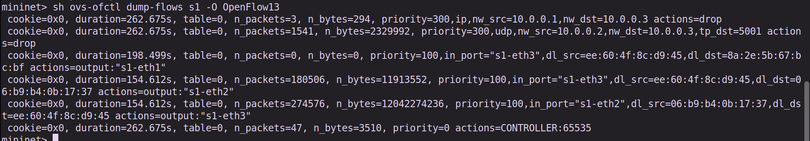
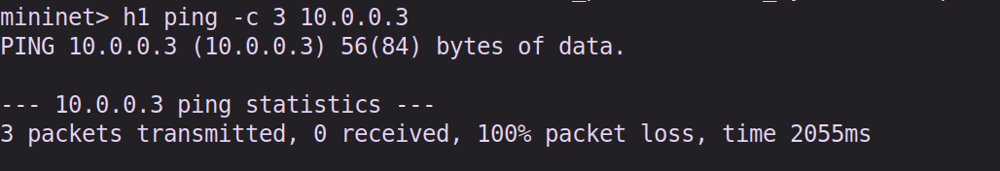

# Packet Drop Simulator

Simulate packet loss using SDN flow rules.

Install drop rules; •	Select specific flows; • Measure packet loss; • Evaluate behavior; •  Regression test: Verify drop rules persist correctly


## Setup/Execution steps

### Requirements 
- A VM Running a Linux OS (Ubuntu 20.04/22.04) with sudo privileges and internet connectivity in VM.

### Commands Used

Mininet Installation 

```bash
sudo apt install mininet -y
or
sudo apt-get install mininet -y
```

Starting Mininet 
```bash
sudo mn 
```

Connectivity Test 
```bash
mininent>pingall 
```

Exit Mininet 
```bash
mininet>exit
```

OpenSwitch 
```bash
sudo apt install openvswitch-switch -y
```

Ryu Installation - note python3 with pip3 to be installed.
```bash
pip install ryu
```

If virtual environment
```bash
pyenv activate ryu-env
```

## Quick Start

### Terminal 1

```bash
ryu-manager controller.py
```

### Terminal 2

```bash
sudo python3 topology.py
```

### Terminal 3
```bash
sudo wireshark # to capture packets
```

#### SCENARIO 1 - PING TEST
```bash
h1 ping -c 3 10.0.0.3 # 100% loss (dropped)
h2 ping -c 3 10.0.0.3 #0% loss  (allowed)
h1 ping -c 3 10.0.0.4 #0% loss (allowed)
```


#### SCENARIO 2 - IPERF TEST

TCP (allowed)
```bash
h3 iperf -s &
h2 iperf -c 10.0.0.3 -t 3   #bandwidth > 0
```

UDP (dropped)
```bash
h3 iperf -s -u &
h2 iperf -c 10.0.0.3 -u -b 5M -t 3 # "did not receive ack"
```

Clean up servers when done:
```bash
h3 pkill iperf
```


#### SCENARIO 3 - REGRESSION TEST

Wait ~10 seconds idle, then verify rules are still installed:
```bash
sh ovs-ofctl dump-flows s1 -O OpenFlow13
```
Expect: drop entries for 10.0.0.1->10.0.0.3 and udp tp_dst=5001


Re-run the ping to confirm enforcement:
```bash
h1 ping -c 3 10.0.0.3       #still 100% loss
```

Stop wireshark capture after this. Force kill controller and exit mininet on Terminal 2. 


### OUTPUT SCREENSHOTS

#### STARTING CONTROLLER



#### STARTING TOPOLOGY



#### CONTROLLER AFTER TOPOLOGY STARTED



#### FIRST PING (DROPPED)



#### SECOND PING (ALLOWED)



#### TCP (ALLOWED)



#### UDP (BLOCKED)



#### REGRESSION TEST - FLOW TABLE



#### DROP RULES RETAINED FOR PING


